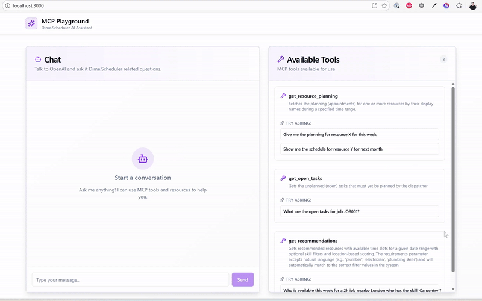

<div align="center">

</div>

<br />
<div align="center" >
<h1>Dime.Scheduler MCP Server Playground</h1>
</div>

<p align="center">
  <a href="https://docs.dimescheduler.com">Documentation</a> |
  <a href="https://docs.dimescheduler.com/history">Changelog</a> |
  <a href="https://docs.dimescheduler.com/roadmap">Roadmap</a>
</p>

A sample playground to try the Dime.Scheduler MCP Server.

<div>

</div>

## Getting Started

### Prerequisites

- Node.js (v22 or higher)
- npm, yarn, pnpm, or bun
- OpenAI API key
- Dime.Scheduler MCP API key

### Installation

1. Clone the repository and install dependencies:

```bash
npm install
# or
bun install
```

2. Create a `.env` file in the project root:

```env
VITE_OPENAI_API_KEY=your_openai_api_key_here
VITE_DIME_SCHEDULER_API_KEY=your_dime_scheduler_api_key_here
```

## Configuration

### Environment Variables

Create a `.env` file in the project root with the following variables:

- `VITE_OPENAI_API_KEY`: Your OpenAI API key
- `VITE_DIME_SCHEDULER_API_KEY`: Your Dime.Scheduler MCP API key

**Note**: In Vite, environment variables must be prefixed with `VITE_` to be exposed to client-side code. As a result, do not ever put this application in production as it is a serious security risk!

## Running the application

3. Start the development server:

```bash
npm run dev
# or
bun dev
```

The application will open at `http://localhost:3000`

Use the sample questions in the panel on the right hand side to explore the MCP Server.

## Security Note

⚠️ **Important**: This application uses `dangerouslyAllowBrowser: true` for the OpenAI client, which means API keys are exposed in the browser. For production use, you should:

1. Create a backend proxy server to handle OpenAI API calls
2. Store API keys securely on the server
3. Never expose API keys in client-side code

## License

MIT
